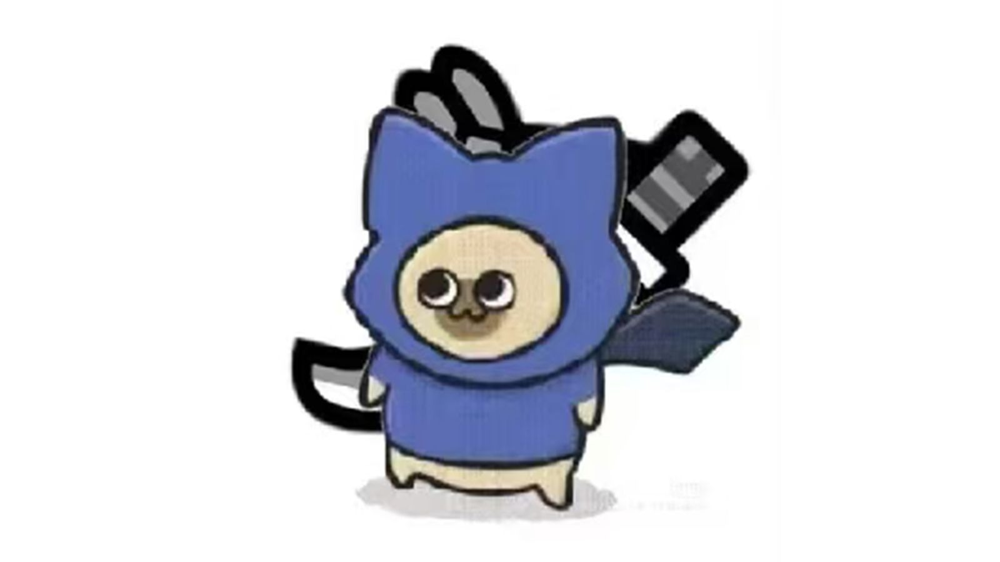

## 从荒野、崛起到世界，分析卡普空在怪物猎人三部曲中对于动作系统的更迭与进化

切居登猫，虾头太刀。玩怪猎不玩太刀就像吃薯条不沾番茄酱。三盏灯亮起的虫棍是多少人心目中唯一的完美武器。当角力触发镜头拉近，没有人能抵挡这样的暴力美学。在今年上半年***怪物猎人荒野***发售后，全新的集中模式狩猎也让怪猎这个ip中动作系统的深度更上一层楼。

>本文将从荒野到世界，以反向的视角来看怪猎新时代的三部里动作系统的更迭与进化。

我在玩**荒野**之前只是怪猎系列的轻度玩家，并不是人们常说的"老猎人"。而在**荒野**彻底毕业了之后，因为内容少感觉没玩够，我又将最近的几部和他们的dlc全部打到解禁彻底毕业。而现在，我带着三个月300+小时和怪物们厮杀的余温，来逆向分析一下这三作求同存异的动作系统。

### 同：历年的怪猎传承下来的战斗系统

怪猎系列的战斗系统一直以来都同时聚焦于武器和怪物。每种不同怪物都有极具风格的招式组。但今天我们主要来聊聊武器。从三种武器到现在十四种武器，卡婊证明了他们有能力制作相当平衡的战斗系统。而这个战斗系统是完全基于**派生**这个逻辑的。不同于其他ARPG或者ACT游戏，怪猎是没有基于武器可以直接使用的主动技能的。有的是基于基础招式的大量派生招式。而多数时候想要正确打出伤害必须要正确理解使用的每一把武器的派生逻辑并将其操作出来。

>刨去这些武器本身近战和远程的区别，这些武器可以大致分成**资源型**（例如太刀、斩斧、盾斧等）和**派生型**（单手剑、大锤等）。
顾名思义，资源型武器有一种重要的资源直接关系武器能打出的伤害。而派生型武器虽然省去了攒资源的步骤，但是通常需要"凹"出那一套派生中的最后一招才能打出最高伤害。而这个阶段可能需要更多的时间并且更容易被怪物的攻击打断。

### 异：一、集中模式造就的地面机动巅峰

**集中模式**可以说是***怪物猎人荒野***的战斗系统中最重要的一环了。玩过以前任意一款怪猎的都一定体会过 "后摇太大，转不过来身"的烦恼。而集中模式可以说在零成本的前提下完美解决了这一问题。只要长按左扳机，就能让你在出招前再也不用考虑自身与怪物的方向。因此，很多人（包括我）都认为这一作是最适合新人上手入坑的。长久以来，怪物猎人动作系统与玩家的交互思路都是玩家在下位熟悉武器的招式，在上位熟悉在与怪物交互中如何合理立回将武器打出最高输出并在G位精通自己全部的技术。而集中模式给玩家带来的是掌握连招后不那么需要研究怪物的连段，因为可以通过二次更改方向的方式保证自己的连段不会空。这简直就是对狩猎新手最大的福音。

**集中模式**绝不仅是有利新手的一个功能，它和与它相辅相成的**动态伤口系统**系统还充当着这一作中掌握狩猎节奏的功能。在**荒野**的一场狩猎中，武器在连续击打怪物的一个部位后会使怪物出现伤口。而处决这个伤口后，你将会同时得到：
- 高额的伤害
- 怪物倒地/硬直
- 一些武器重要的资源（例如太刀的一层刃，斩斧对应形态的能量条，）
>因此，有意的击打同一个部位创造伤口并在合适的时间利用集中模式特殊技破坏伤口就是这作狩猎节奏的核心。

形成并破坏伤口所需求的精准性完美匹配上集中模式的优点，使得猎人只需按住一个按键就可以将狩猎节奏掌握在自己手里，随时转向应对怪物的换位/变招。**荒野**这样的地面机动灵活程度在怪物猎人系列中至今都是唯一。 

在集中模式结合武器方面，集中模式极大地利好了**大剑**这类前后摇大并且招式频率低数字大的武器。大剑的派生逻辑完全基于*蓄力攻击*砍下去的那一刀，而蓄力又分为"一蓄"，"强蓄"和"真蓄"。后二者是主要的输出派生。其他的招式基本都是为了帮助立回或者往这两个招式派生的。因此,大剑打出伤害的核心就是保证高伤害的蓄力攻击精准命中怪物肉质（吸收伤害）好的部位。而大剑玩家在集中模式的帮助下无需在蓄力前就将朝向调整到正面面对怪物，使大剑成为一个先蓄力等怪移动再调整朝向命中怪物的武器，由此大大提升了大剑蓄力攻击的命中率。

### 二、翔虫打造的立体机动

***怪物猎人崛起***与另外两部之间有着最大的区别。在荒野和世界聚焦于环境生态系统时，崛起将资源全部投入了游戏的战斗系统中。这也使得崛起的战斗系统不论是狩猎前，狩猎时还是狩猎后都跟其他怪猎有很大的不同。而这一切都源自于**翔虫**系统。

>**翔虫**系统是在游戏中任何状态都可以使用的系统。玩家初始是有两个，可以通过在野外拾取短时间拥有三个。在跑图/赶路/爬山时可以利用翔虫像蜘蛛侠一样立体机动。而在战斗中不但可以使用每一把武器都有的**翔虫技**，也可以用**翔虫受身**来从怪物的击飞或者捕食中即刻脱离。

在狩猎中，每种武器都有各自衔接**翔虫技**的派生。因为在原有的招式派生中增加了新技能，看似狩猎的节奏会变慢。但实则恰恰相反，**崛起**中的战斗节奏远远快过其他怪猎，甚至是荒野。原因首先在于**翔虫受身**这一被动技能。不论是**荒野，世界**还是任何一款怪猎，被怪物击飞是一件很令人头疼的事。从地上爬起来并收刀吃药时不能回避的硬直被怪物追刀可以说是猎人们猫车最多的原因。而**翔虫受身**可以在消耗一个翔虫的前提下直接直接跳过这段硬直并位移一段距离，在怪物后摇无法追刀时就将血量回到健康的状态，并以满状态应对怪物接下来的招。这样大大减少了猎人躺在地上的"垃圾时间"。

另一个原因是**翔虫技**的出现大多代替的都是在别作中拥有极高动作值和优先度的重要伤害招式。例如太刀的"登龙"这一项有着大前摇大后摇却是太刀主要出伤招的技能，在崛起中成为了一个**翔虫技**，只有消耗翔虫才能施放。而为了弥补有限的翔虫，登龙的前后摇都被大幅度缩短。而这样的设计也被沿用到各类武器中。这也是崛起平衡游戏节奏并与其他怪猎的狩猎体验做出区分的地方。通过减少招式前后摇的方式让狩猎感更加流畅，但又通过将重要出伤招与翔虫绑定来确保不会发生因为狩猎节奏过快导致战斗时间被大幅被缩短的情况。

而在猎人完全掌握对应武器的招式之后，**替换技**系统又会浮出水面。**替换技**会改变武器的一些重要派生以及极大的影响出伤逻辑甚至是游玩思路，但替换的技能通常并不会完全改变这个技能本身在技能循环中的地位。例如**虫棍**调整身位的技能"飞身跃入斩"可以替换成带有GP判定但前后摇严重的"旋转突进斩"。这个技能始终都是在追刀时使用，可是只有"旋转突进斩"可以正面GP怪物的招式。因此在打攻击欲望强并且很难通过翻滚规避技能的怪物时常常就会带上"旋转突进斩"作为一个快速立回的招式增加输出。因此，**替换技**更多时候是提供一个狩猎中转换思路的选项，猎人可以对不同的怪物选择不同功能性的替换技来提高狩猎体验。因而并不会对狩猎节奏有本质化的影响。
>所以说，**翔虫**依然掌管着这一作的狩猎节奏，将以往很多硬直这类会令玩家不快的减缓狩猎节奏的方式优化并变成了翔虫系统的**有限程度**。用cd和数量作为节奏的限制，既保证了猎人丝滑狩猎的游戏体验，又避免游戏节奏过快与以往怪猎游戏节奏不符的问题。

### 三、让狩猎公式化的钩爪系统
 ***怪物猎人世界和冰原***是新时代怪猎的始祖。这一作与前作最大的提升是在于画质和前无古人的生态系统。在战斗系统中，通过各武器招式的数值差距可以看出不同于上面的两部，制作人想推崇"大招流"，也就是让玩家在狩猎中尽可能尝试重复地打出伤害最高的招式。因此**钩爪机制**应运而生。猎人可以使用钩爪上到怪物的任何一个部位上并有以下几个招式选择
 - 使用小刀进行攻击，造成极低的伤害。
 - 使用手里的投射器全弹发射，可以使怪物向前冲锋一段距离，如果成功**撞墙**，将会造成高额伤害并倒地大硬直。
 - 使用一部分耐力击打怪物，是怪物转身90度，最多三次。
 - 使用武器对当前部位软化，软化后180秒内肉质变好伤害增加。

>在这样构筑的一个系统下，**钩爪**的使用就会非常公式化。先软化增加输出，在有投射器时撞墙使怪物倒地后输出便可打出钩爪动作里理论最高伤害。

不仅如此，**钩爪**实际还有控制狩猎节奏的功能。怪猎有一个**怒气**的机制。很多怪物在进怒之后全身肉质都会变好。并且可以触发"挑战者"技能大幅提高猎人伤害。在其他作中，怪物通常会在被灌一定量的伤害后进怒。挑战者的覆盖并不完全。钩爪招式中使怪物转身的击打技能每一次击打都能积攒大约1/3的怒气条，因此怪物在被击打三次后必定进入**怒气**状态，并会持续大约180秒。由此，猎人常常会使用钩爪上头使怪物主动进怒并撞墙或者软化来打出最高输出。而在狩猎**冰原**G位后期这些例如黑龙、冰呪龙这些高血量需要长时间战斗的怪物时结合软化和怒气状态的持续时间，确保在进怒时对软化部位高伤害派生的覆盖率从而达到最大输出。

这三套特点不同的战斗系统打造了怪猎新三部曲中截然不同的狩猎节奏。按发行的时间顺序，看得出卡普空在每一代作品中都在有意识地针对玩家操作体验和战斗节奏进行深度打磨。从《世界》的钩爪公式化与生态系统，到**崛起**的翔虫立体机动，再到**荒野**集中模式下的极致地面操作，每一套动作系统的更迭都不是简单的叠加，而是对"武器-怪物-玩家"三者关系的再平衡与创新。三部曲的动作系统进化，既保留了怪猎系列"派生"逻辑下的深度操作乐趣，也通过新机制不断降低上手门槛，拓宽了玩家群体。卡普空用持续的系统革新，让**怪物猎人**这个ip始终保持着动作游戏领域的独特地位。

回望这三作，怪猎的动作系统始终在传承与突破之间前行。无论是老猎人还是新玩家，都能在这不断进化的动作系统中，找到属于自己的狩猎节奏与乐趣。

