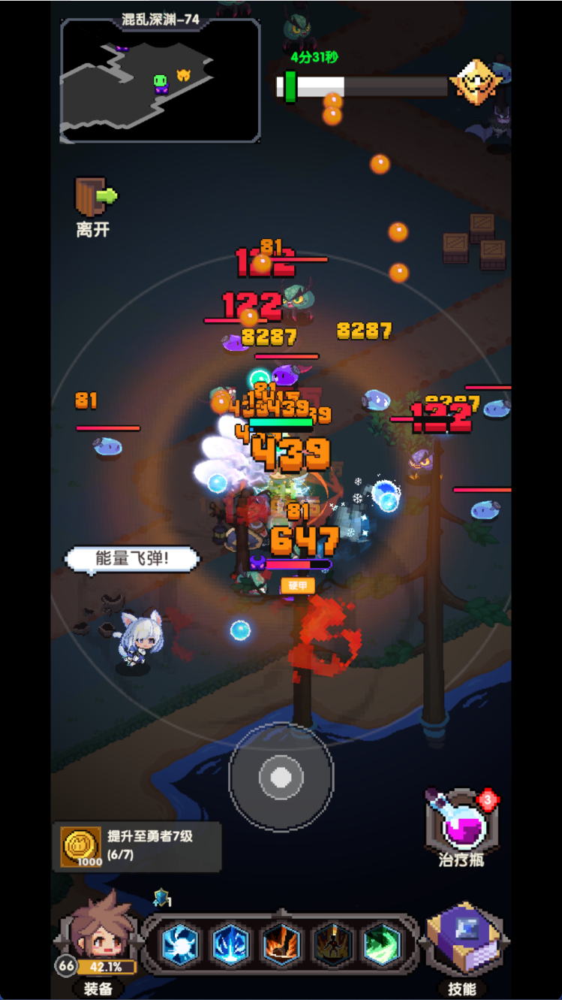
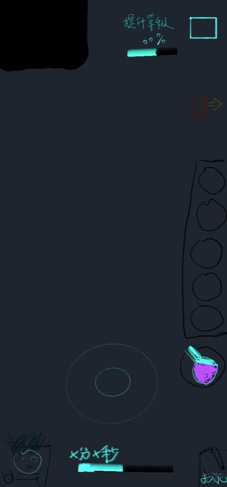

# 《冲吧，帕克》游戏测试建议

## 一、个人游玩体验感受

《冲吧，帕克》作为一款尚未正式上架的半挂机刷怪横版游戏，在核心系统和玩法设计上明显借鉴了《英雄没有闪》的诸多元素，包括但不限于：
- **玩法元素**：角色成长、装备系统、技能释放、挂机收益等核心循环与《英雄没有闪》高度相似。
- **UI与家园设计**：主界面布局、功能入口、家园系统的建筑与交互方式等，均与《英雄没有闪》有较高的相似度。

但在主要gameplay体验中，《冲吧，帕克》采用了类似《元气骑士》的摄像机位置设计和地图探索方式，呈现出一定的2D横版探索感。实际体验中，地图虽然具备一定的探索路线，但交互内容较为稀少，探索深度与《英雄没有闪》相似，但是不如《元气骑士》这类肉鸽游戏。建议在地图中增加如散落可收集的钻石、宝箱等探索元素，提升玩家探索积极性和地图互动性。

此外，在探索完毕后生成的两个传送门，有时会出现生成在地图边缘以外、导致无法进入的情况。建议在传送门生成逻辑中增加锚点范围检查，确保传送门始终生成在地图可达区域内，避免玩家卡关或体验受损。

**装备系统对比与建议**：目前装备系统与《英雄没有闪》类似，但缺少自动分解功能，需要玩家手动点击分解装备。建议增加自动分解战力比当前装备低很多的装备的功能，减少玩家操作负担，提升便捷性。

**技能系统改进建议**：建议在技能总体页面增加原本属于单独技能页面的技能符文一键升级功能，实现一键升级所有子技能中可一键升级的技能符文，进一步提升操作便捷性。

**一键领取体验建议**：目前部分礼包、奖励等界面有“一键领取”功能，部分没有，建议确保所有礼包、奖励、邮件、日常任务等页面都能通过一键领取按钮实现全页面奖励一键领取，减少重复操作，提升用户体验。

---

## 二、个人改进意见

- **探索UI可优化**：
    - 建议将技能栏竖直排列放到屏幕右侧，治疗瓶放到技能栏一侧。
    - 离开键放到右上角现在位置的对侧。
    - 将象征关卡进度的进度条和时间放到原本技能栏的位置。
    - 左下角的游戏目标放到原进度条的画面右上角。
    - 以上为可选改进方向，具体以实际体验和美术风格为准。
    
    **改进原因说明：**
    本次UI改进主要考虑到大多数用户为右手握持手机，竖直排列技能栏和相关按钮有助于提升单手操作体验。同时，将目标和奖励等信息放到更醒目的位置，可以让玩家更容易获得正反馈，增强游戏的激励感和目标感。此外，这样的UI布局优化也能有效避免与《英雄没有闪》等同类游戏的界面同质化问题，形成《冲吧，帕克》独特的视觉识别度和用户体验。

**UI优化示例：**

| 原游戏UI布局 | 改进后UI布局 |
|-------------|-------------|
|  *技能栏水平排列在底部，治疗瓶在右下角，离开键在右上角，进度条在顶部* |  *技能栏竖直排列在右侧，治疗瓶在技能栏下方，离开键移到左上角，进度条移到原技能栏位置* |

---
 